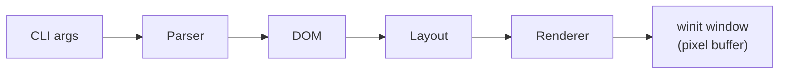

# radium — Design Document

## Goal

A learning-oriented HTML rendering engine that:
- Accepts a single HTML file via CLI
- Parses it into an in-memory DOM
- Computes a simple block layout
- Renders the result into a native window using a software rasterizer

No CSS support in v1. No JavaScript. HTML only.

---

## Architecture



### 1. Parser (`src/parser/`)

Hand-written tokenizer + tree builder. Scope:

- Tokenizer: reads raw bytes → `Token` enum (`OpenTag`, `CloseTag`, `Text`, ...)
- Tree builder: turns token stream → `Node` tree (DOM)

Supported tags (v1):
`html`, `head`, `title`, `body`,
`h1`–`h3`, `p`, `div`, `span`,
`ul`, `ol`, `li`,
`strong`, `em`, `a`, `br`, `hr`

### 2. DOM (`src/parser/dom.rs`)

```
Node
 ├── Element { tag: String, attrs: HashMap<String,String>, children: Vec<Node> }
 └── Text(String)
```

### 3. Layout Engine (`src/layout/`)

Converts the DOM into a flat list of **boxes**, each with:
- Position `(x, y)`
- Size `(width, height)`
- Paint command (text, rect, line, ...)

v1 is purely block-level (no inline flow, no floats).

### 4. Renderer (`src/renderer/`)

- Opens a `winit` window
- Allocates a pixel buffer via `softbuffer`
- Draws each box using `tiny-skia` (CPU rasterizer)
- Redraws on `RedrawRequested` events
- Scrolls vertically on mouse wheel / arrow keys

---

## Non-Goals (v1)

- CSS parsing or styling
- JavaScript
- Images
- Tables
- Inline text flow (word-wrap across lines is a stretch goal)
- Network requests
